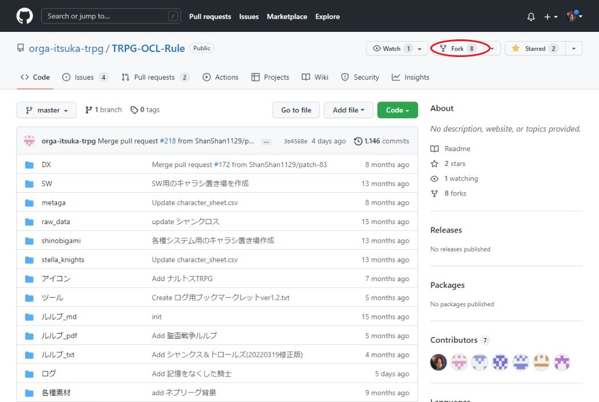
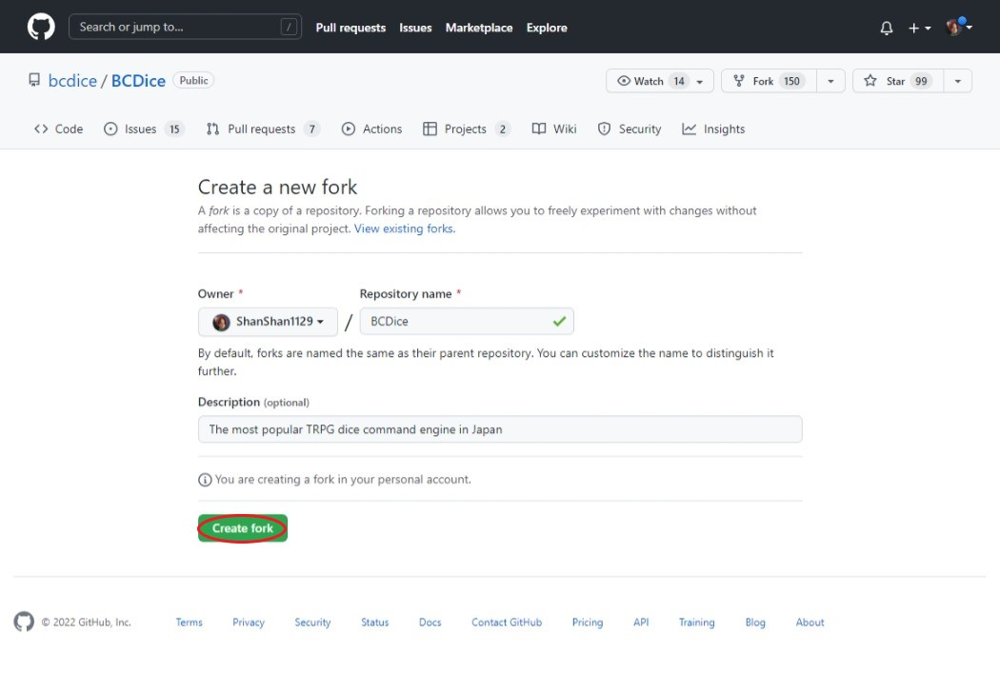
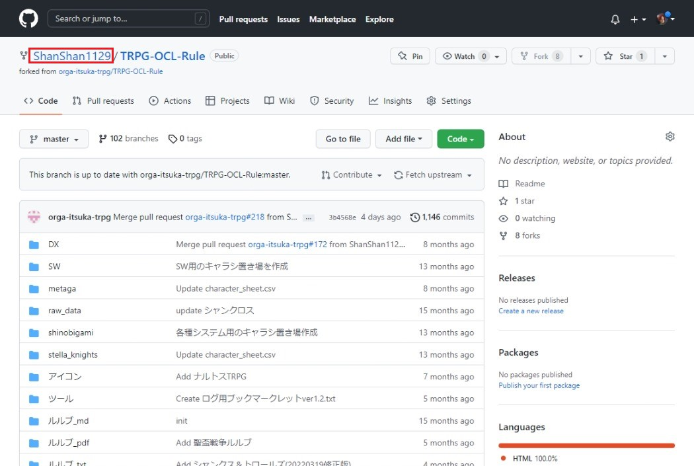
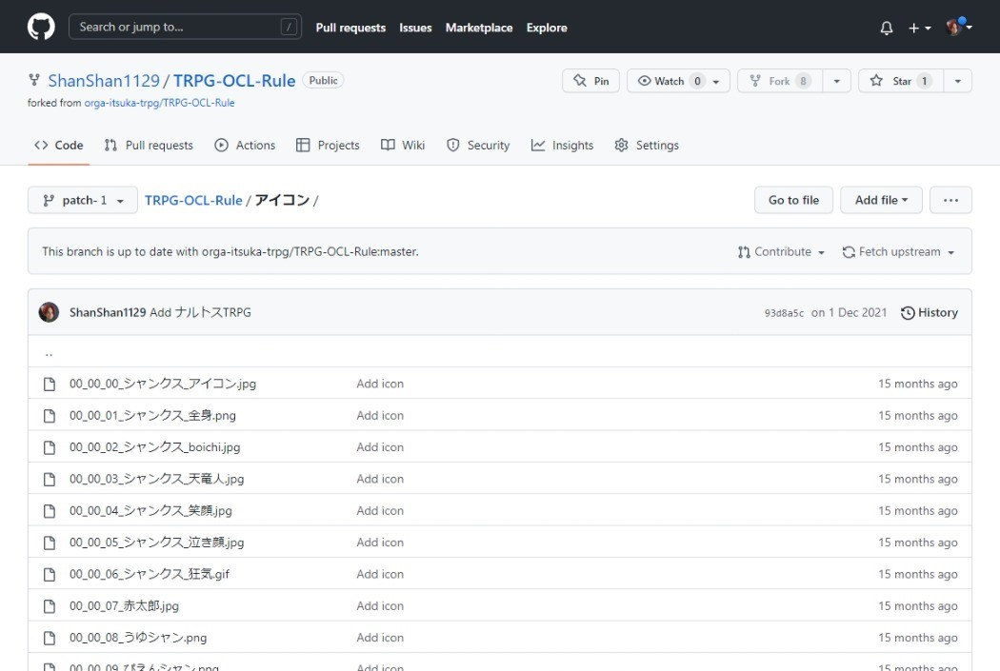
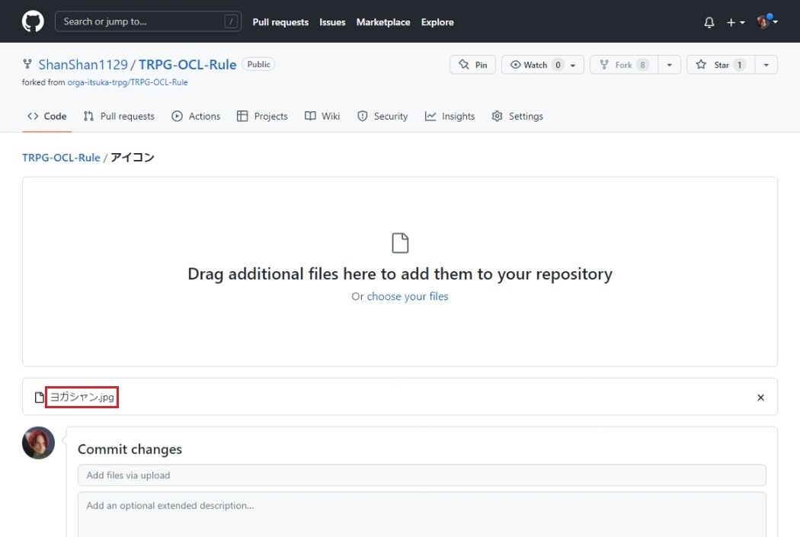
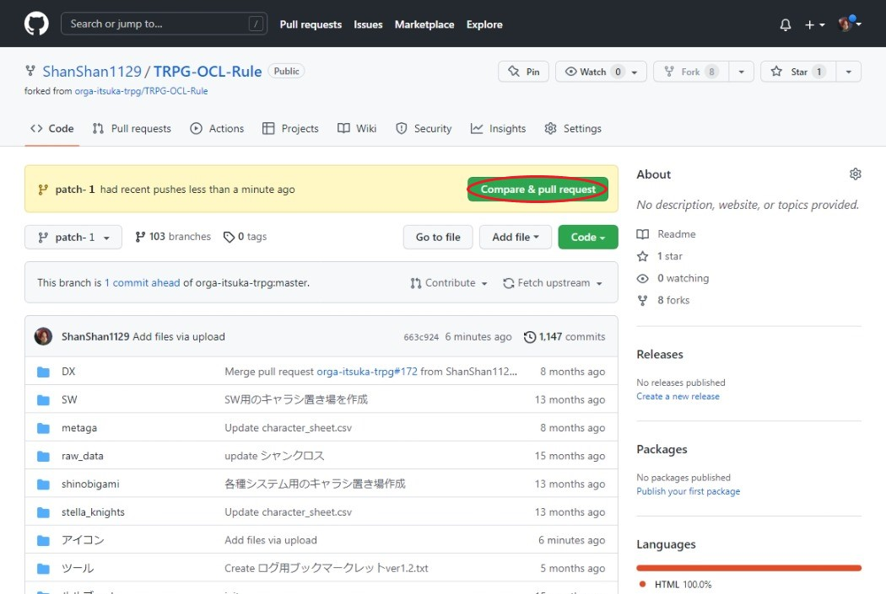
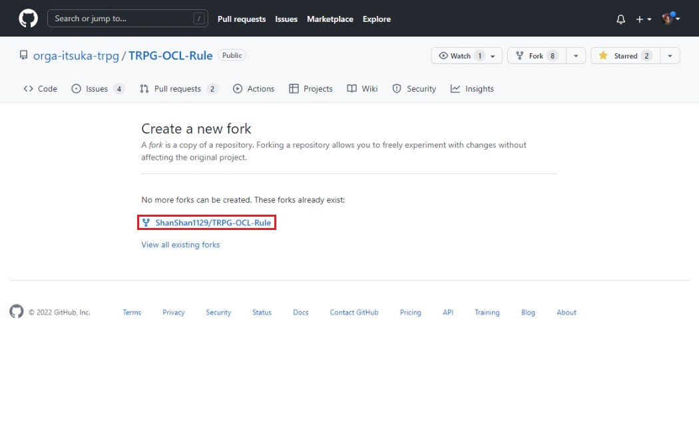
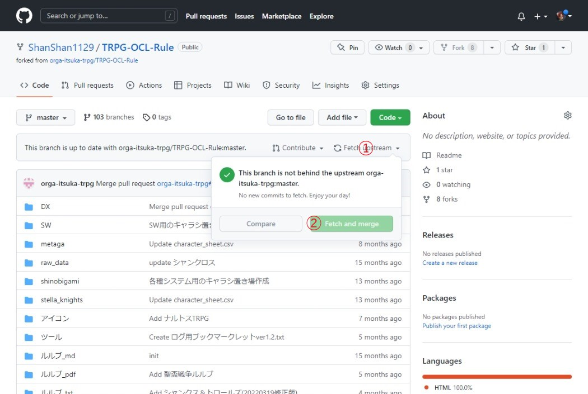

# このリポジトリについて

TRPG のルルブをまとめたリポジトリであることをお前に教える。
本当はマークダウンでいい感じに書き直そうと思っていたが量が多いため断念したことをお前に教える。

いつかきっとプルリクしに来い 立派なマークダウンファイルになってな

また、ルルブに限らず TRPG を円滑に進めるためのサービス・ツール・素材(ライセンスについては要注意)があったら、これもプルリクエスト出してくれ(^^)
ログもプルリクエストを出してもらえれば追加できることを教える、手間をかけてすまん(Thanks.)

## ログを見たい人向け
`log` ディレクトリ以下にファイルが置いてあることを教える。
名前とか適当に変えたいときは次項の共有の仕方を参照しファイル名を変えたりしてくれ(^^)

`.txt` ファイルならクリックすれば簡単に見れるな…ルフィ

でもォ…←HTMLファイルはソースコードが出てるという難点が…

`.html` ファイルに関しては [https://htmlpreview.github.io/](https://htmlpreview.github.io/) のフォームにファイルのURL (例: https://github.com/orga-itsuka-trpg/TRPG-OCL-Rule/blob/master/%E3%83%AD%E3%82%B0/%E3%82%B7%E3%83%A3%E3%83%B3TRPG%E3%83%AD%E3%82%B02021_10_02%E3%81%BE%E3%81%A7/4%E6%9C%88/%E3%82%A2%E3%82%AD%E3%83%8D%E3%82%A4%E3%82%B7%E3%83%A3%E3%83%B3%5Ball%5D.html ) をフォームに入力し `Preview` ボタンを押すと見れることを教える。

こんな感じのURLが生成される https://htmlpreview.github.io/?https://github.com/orga-itsuka-trpg/TRPG-OCL-Rule/blob/master/%E3%83%AD%E3%82%B0/%E3%82%B7%E3%83%A3%E3%83%B3TRPG%E3%83%AD%E3%82%B02021_10_02%E3%81%BE%E3%81%A7/4%E6%9C%88/%E3%82%A2%E3%82%AD%E3%83%8D%E3%82%A4%E3%82%B7%E3%83%A3%E3%83%B3%5Ball%5D.html

少し手間がかかるがこんな感じで使ってくれ(^^)

---

有志により外部サイトに頼らずログを見れるようになったことを教える
(まれに最新のログが反映されていない現象を確認しました。現在、調査中です。下記リンク先にて見たいログが見つからない場合は、お手数ですが先に書いてある外部サイトを利用しログを確認してください)

https://orga-itsuka-trpg.github.io/TRPG-OCL-Rule/logViewer.html

## 共有の仕方
共有の仕方についてお前に教える。

### GitHub のアカウント作成
まずはこのサイト [GitHub](https://github.com/) のアカウントを作成する必要があることをお前に教える。

上記リンクから飛ぶと GitHub のトップページが出るので右上の "Sign up" をクリック。

画像のように下記項目を入力する。

- ユーザ名
- メールアドレス
- パスワード

次に "Verify your account" から出されるクイズに回答をする。
IQ28でも答えられる問題だから安心してくれ(^^)

"Email preferences" というチェックボックスがあるが、これは販促メール送るかどうかの確認項目なのでチェックを入れず "Create account" をクリックして問題ないことを教える。

アカウント作成に成功すると、そのアカウントのダッシュボードみたいなものが表示される。

あとは登録時のメールアドレスに GitHub から認証メールが届いているのでそれを開きリンクをクリックし登録を完了させる。
アカウント登録は以上だからよ…

### ルルブや素材の追加

追加したい項目がある場合はこのリポジトリ(GitHub・Gitでは共有する場所をリポジトリと呼びます)を開くからよ…

[https://github.com/orga-itsuka-trpg/TRPG-OCL-Rule](https://github.com/orga-itsuka-trpg/TRPG-OCL-Rule)

開いたら追加したい項目を選びクリックしてくれ(^^)

例えばルルブを追加したい場合は "ルルブ_txt" を開くぞぉ！

ここから右上の "Add file" -> "Create new file" を選択するからよ…

するとこんな画面になるので、ファイル名とファイルの内容を記載してくれ(^^)

最後に画面下部の箇所で "Propose new file" 説明なりなんなりを書いてくれ(^^)
書かなくても別に問題はないことを教える。

そして緑色の "Propose new file" ボタンをクリックすることを教える。

するとこんな感じに、「あなたが作ったパッチはGitHubのあなたのアカウントに反映されました。 orga-itsuka-trpg に差分を送りますか？」と言った画面が表示される。

#### ここで緑色の "Create pull request" を押すからよ…

すると送る差分(以降プルリクエストと呼ぶ)のタイトルとコメントを記載する画面に移るので各項目を埋めてくれ。
なるべくどのような変更を加えたか具体的に書いてくれると助かる(Thanks.)

各項目を埋めたら "Create pull request" をクリック。

上の画面に移ったらプルリクエスト成功だからよ…
このプルリクエスト欄で「このファイルはxではなくyのディレクトリに入れてください」「うわ！ありがとう！」なんてコメントしあいながら元リポジトリに反映するための連絡を取り合うからよ…

基本的にプルリクエストを送る側としてやることは以上だからよ…

### 画像やpdfファイルの追加
ここからは画像やpdfファイルを追加する時の手順だからよ…  
これらのファイルなどは権限の都合上、ちょっと手順が異なることを教える  
また一度プルリクをやってくれたシャンカーの場合、追加で最初にやることが1つあるので、  
この章をさっくり読みつつ[こちらも読んでおいてくれ(^^)](#2回目以降のプルリク協力シャン向け)  

#### ①リポジトリのフォーク
まずは追加にあたってリポジトリのフォークという手順を行う必要がある  
このリポジトリをコピーするような物だ、気軽にやるぞ　来い  
ページの右上にあるforkを押してくれ(^^)  
||
| ----- |

そうすると下のようにforkする際の名前の設定などのページが出てくる  
ここは特に何も変更せずにCreate forkでいいよ～  
||
| ----- |
注：アカウントの都合上、ここでは別のリポジトリ(BCDice)のfork画面を使っていることを教える
　　実際はRepository nameやらDescriptionやらが違うけど気にしないでくれ(^^)

下のような画面になれば成功だな　ルフィ  
赤で囲まれたShanShan1129となっている部分は、自分で決めたユーザ名になっているはずだ
||
| ----- |

#### ②ブランチ作成
次はブランチというものを作る  
ブランチ切替のボタン①を押して、下の`Find or ...`②のところにpatch-1と半角で入力してくれ  
そうしたらcreate branch...③ という表示が出るのでそれをクリックする　来い 
||
| ----- |
注：この時create branchが出なかった場合、もうそのブランチは作成済みだ　番号を2、3とずらしていくことを…勧める…

上にBranch created. と表示されてたらブランチ作成完了だァ～～～！！！  
ということで、ここからファイルの追加を行っていくことを教える

#### ③各種ファイルのアップロードとコミット
ここから念願のファイルの追加作業が始まることを教える  
今回はアイコン画像の追加をするぞ　来い　(pdfファイル等も同じ手順でできるので、フォルダを適宜合わせてくれ(^^))  
ということでアイコンフォルダを開いて…  
実はこの画面、ファイルをドラッグアンドドロップ(以下D&D)することができるぞォ！  
複数まとめてでも大丈夫　githubのインターフェースは格が違う  
||
| ----- |

そしてアップロードする画像をD&Dすると下のような画面になる  
今回は例としてヨガシャン.jpgをアップロードした  
こんな感じに追加したいファイルがアップロードされたことを確認してくれ(^^)  
||
| ----- |
注：失敗する場合ファイル名に問題があることが多い　全角スペースとかは御法度だなァ…

確認ができたらCommit changesを押すぞォ！  
|なんだ！？(^^)と思ったシャンカーはサル先生のGit入門というサイトを見ると理解を深められるかも")|
| ----- |

処理が終わるとブランチのトップに戻されて、
差分ができたからプルリクしてくれ(^^)ってメッセージが新たに表示されることを教える  
なので早速プルリクだァ～～～！！！  
||
| ----- |

ここから先は上の方にあったプルリクのタイトルやコメントの記載と同じなので省略・皇  
[ここを読んでくれ(^^)](#ここで緑色の-create-pull-request-を押すからよ)

### 2回目以降のプルリク協力シャン向け

2回目以降やらないといけないこと

ここでは2回目以降プルリクを行った場合に確認しなければならない"masterブランチの同期"をお前に教える  
#### masterブランチの同期
まずは自分のforkしたリポジトリに移動するぞ　来い  
ページの右上にあるforkを押してくれ(^^)  
||
| ----- |

そうした場合、下のような画面になるはずだ  
要は一度つくったからそれ以上はいらねェよなァ？って画面だな  
気にすることなく赤枠のリンクを押してくれ(^^)  
||
| ----- |

そうすることでforkした自分のリポジトリを開けるぞォ！  
そしてその画面でブランチの同期を確認するぞ　来い  
Fetch upstream①を押した後、Fetch and merge②のボタンが薄かったら最新の状態に保たれている、濃かったら同期が必要のサインだ　押してくれ(^^)  
||
| ----- |

押した場合は上に`Successfully fetched...`と表示されれば宴だァ～～～！！！  

こんな感じに最新のバージョンになっていることを確認できたら、この後は[②ブランチ作成](#ブランチ作成)に従ってファイルを追加、プルリクしてくれ(^^)  

### 送られたプルリクエスト反映作業
どのようにプルリクエストを反映させるかを記載するからよ…
この欄は気になる人以外は読み飛ばして良いからよ…

プルリクエストが届くとこちら側では次の画像のように見えるからよ…

正当なプルリクエストならここで "Merge pull request" をクリックし、送ってきてくれた内容を反映させるからよ…

今回はプルリクエストの練習用だったので強制的にクローズさせたが、みんなどしどし送ってきて欲しいからよ…

#### 最後に

このリポジトリについて問題があったら `issue` を立ててほしいことをお前に教える。
手間をかけてすまん(Thanks.)

また、スレで自己主張は行わないのでそういう輩を見つけた時はなりすましだと思ってくれ。

#### 最後の最後に
最近GitHubくんがログインするたびに意地悪な質問をするようになってきました(多要素認証の有無やら何やら)
で、たまにログイン失敗する時があります。
影響を鑑みて、数ヶ月音沙汰がなかったら `orga-itsuka-trpg` は死んだとして扱ってくれ(^^)
死んだ時はログを提出してくれるシャンに全てを託す。
幸いログ集積所があるので、そこにログを提出してください
https://ccfolia.com/rooms/9FtNIhx-X
よろしくお願いいたします。
